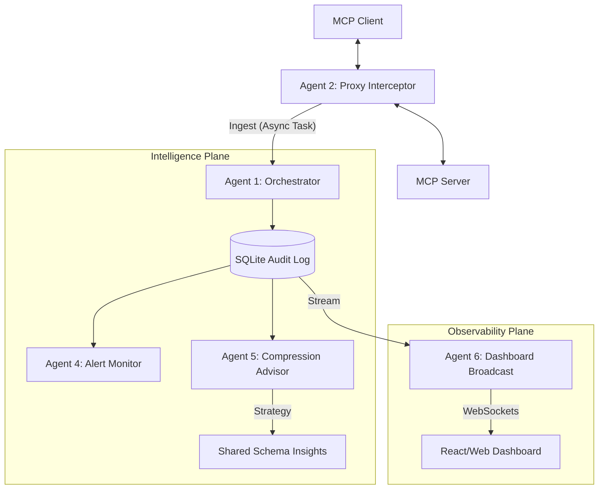

# 🔎 MCP Token Auditor: Real-Time Performance intelligence

[](https://opensource.org/licenses/MIT)
[](https://www.python.org/downloads/)
[](https://modelcontextprotocol.io)

**MCP Token Auditor** is a production-grade, multi-agent proxy intelligence layer designed for high-throughput observability of MCP (Model Context Protocol) tool consumption. It acts as an transparent observer between MCP clients and servers, providing deterministic token counting, real-time alerting, and static analysis for tool optimization.

---

## 🏗️ System Architecture



---

## 🚀 Key Features

- **⚡ Zero-Latency Proxying:** Decoupled audit logic using non-blocking background tasks ensures `<5ms` overhead on the critical path.
- **🔢 Deterministic Counting:** Uses `tiktoken` (o200k_base) with MD5-keyed caching for sub-millisecond token counts.
- **🚨 Advanced Alerting:** Real-time enforcement of `CALL_SPIKE`, `SERVER_DRIFT`, and context window thresholds.
- **📉 Compression Advisor:** Static analysis heuristics (Cloudflare code-mode, redundancy, deduplication) to reduce context window bloat by up to 30%.
- **📊 Live Streaming:** WebSocket-powered event feed for real-time dashboard hydration.

---

## 🛠️ Getting Started

### Prerequisites
- Python 3.10+
- Docker & Docker Compose (optional)

### Installation
```bash
git clone https://github.com/Ismail-2001/mcp-token-auditor.git
cd mcp-token-auditor
pip install -r requirements.txt
```

### Running the Auditor
```bash
# Set environment variables
export MCP_AUDITOR_API_KEY="your-secure-key"

# Start the application
python -m src.main
```

---

## 📊 API & Endpoints

| Category | Endpoint | Method | Description |
| :--- | :--- | :--- | :--- |
| **Ingestion** | `/api/v1/audit/event` | `POST` | Ingest raw intercept data |
| **Session** | `/api/v1/session/summary` | `GET` | Get session-level token rollups |
| **Metrics** | `/api/v1/metrics` | `GET` | System health & agent metrics |
| **Stream** | `/ws/dashboard` | `WS` | Real-time WebSocket event feed |

---

## 🛡️ Security
This system supports:
- **FastAPI-Native Auth:** Bearer token authentication for all REST endpoints.
- **Rate-Limiting:** Configurable request windows to prevent DoS on the audit layer.

---

## 📜 License
This project is licensed under the MIT License - see the [LICENSE](LICENSE) file for details.

---

**Built with ❤️ for the MCP Ecosystem**
